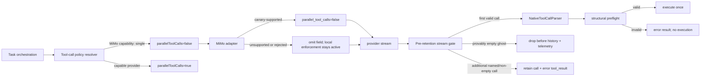

# Architect Research Report: MiMo v2.5 Pro Malformed Parallel Tool Calls

## Task Summary

Research the recurring malformed native tool-call behavior from `mimo-v2.5-pro`, without changing application source code. The investigation covered provider request construction, streamed call assembly, argument parsing, structural validation, dispatch, protocol history, focused tests, diagnostic evidence, and official provider guidance.

## Overview

### Decision summary

Adopt **Option A**: model-capability-driven single-call generation, with MiMo configured as non-parallel-capable. Keep the existing parser and dispatcher safeguards as defense in depth. Do not infer a directory from an object-valued `cwd`, do not silently remove a retained tool call, and do not re-execute or retry a valid sibling that already ran.

### Root cause

Zoo Code already exposes `parallelToolCalls?: boolean` in request metadata, and OpenAI and Anthropic handlers translate it to their native request controls. The normal Task paths, however, hardcode `parallelToolCalls: true`, while the MiMo handler ignores both `parallelToolCalls` and `tool_choice`. Xiaomi's official Zed integration declares `parallel_tool_calls: false` for `mimo-v2.5-pro` and `mimo-v2.5`. The observed failure therefore crosses two policy gaps:

1. The orchestration layer assumes parallel generation is universally safe.
2. The MiMo adapter does not transmit a single-call constraint even when metadata requests one.

The diagnostic proves that prompt guidance alone does not correct the model. The same call shape reappears after explicit instructions to issue one call. The middleware correctly blocks execution and escalates the occurrence, but it cannot prevent malformed generation.

### Confidence

- **High confidence:** Zoo Code can force at most one tool call for providers that honor its metadata.
- **High confidence:** MiMo should be treated as non-parallel-capable. Xiaomi's own integration metadata says so.
- **Medium confidence:** MiMo's API accepts the literal OpenAI request field `parallel_tool_calls: false`. The service is OpenAI-compatible, but Xiaomi's formal request-body page did not explicitly list this field. A provider canary is required before relying on server enforcement alone.
- **High confidence:** Local post-response suppression is still required because a compatible endpoint may ignore an unknown option or return malformed output despite it.

---

# [1. Technical Specification]

## 1.1 Goals and core constraints

1. Prevent MiMo from producing multiple native tool calls in one model turn where possible.
2. Ensure malformed calls can never reach side-effecting tool execution.
3. Preserve the native protocol invariant: every retained assistant `tool_use` ID receives exactly one matching `tool_result`.
4. Preserve valid sibling results. Never execute a successful or already-started sibling twice.
5. Quarantine only calls that are provably empty before they become retained protocol blocks.
6. Make recovery deterministic and observable. Do not perform semantic reconstruction of commands or paths.
7. Preserve provider-specific behavior for OpenAI and Anthropic models that safely support parallel generation.
8. Keep local execution serial unless a separate, explicitly reviewed change introduces concurrent dispatch.

## 1.2 Current cross-domain data flow

```mermaid
flowchart LR
    UI[Webview user request] --> Task[Task orchestration]
    Task --> Meta[ApiHandlerCreateMessageMetadata\nparallelToolCalls=true]
    Meta --> Mimo[MiMo provider adapter]
    Meta --> OpenAI[OpenAI provider adapter]
    Meta --> Anthropic[Anthropic provider adapter]
    Mimo -->|tools only; policy ignored| API1[MiMo OpenAI-compatible API]
    OpenAI -->|parallel_tool_calls| API2[OpenAI API]
    Anthropic -->|disable_parallel_tool_use| API3[Anthropic API]
    API1 --> Stream[tool_call_partial / end]
    API2 --> Stream
    API3 --> Stream
    Stream --> Parser[NativeToolCallParser]
    Parser --> Blocks[assistantMessageContent]
    Blocks --> Preflight[Structural preflight]
    Preflight -->|valid| Dispatch[Serial tool dispatch]
    Preflight -->|invalid| Interceptor[Guided error interception]
    Dispatch --> Result[one tool_result per ID]
    Interceptor --> Result
    Result --> History[API conversation history]
```



### Current request contracts

```ts
interface ApiHandlerCreateMessageMetadata {
  tools?: ChatCompletionTool[]
  tool_choice?: ChatCompletionToolChoiceOption
  parallelToolCalls?: boolean
}
```

Provider mappings:

| Provider | Zoo metadata | Wire representation | Current behavior |
|---|---|---|---|
| OpenAI-compatible | `parallelToolCalls` | `parallel_tool_calls` | Honored, default `true` |
| Anthropic | `parallelToolCalls` | `tool_choice.disable_parallel_tool_use` | Honored |
| MiMo | metadata received | none | Ignored; neither policy field is sent |

### Stream identity and parsing

OpenAI-compatible stream deltas remain separated by `toolCall.index` and call ID. The parser stores per-call argument accumulators and finalizes each ID independently. No application-side cross-call concatenation was found in the stream processor.

The unsafe shape enters later because the final parser construction trusts decoded values:

```ts
nativeArgs = {
  command: args.command,
  cwd: args.cwd,
  timeout: args.timeout,
}
```

The TypeScript cast is not runtime validation. An object-valued `cwd` enters `nativeArgs`, then structural preflight correctly detects it and emits `EI/PARAM_TYPE_MISMATCH/002` before dispatch.

## 1.3 Diagnostic evidence

The inspected diagnostic is from Zoo Code 3.72.0 using provider `mimo` and model `mimo-v2.5-pro`.

Observed failure classes:

1. A valid `execute_command` top-level command had `cwd` replaced by an object carrying another call-like argument.
2. A `search_files` call was emitted with empty input, producing `INVALID_JSON_ARGUMENTS` or missing-argument handling.
3. The model repeatedly stated it would issue one call, then generated the malformed shape again.
4. Occurrence-aware rendering changed the guidance at occurrence 2, but generation still repeated.
5. In several incidents only one native `tool_use` block was retained, while visible XML-like text showed a duplicate call. This means UI text is not a safe source from which to reconstruct or execute a missing sibling.

Representative redacted shape:

```json
{
  "name": "execute_command",
  "input": {
    "command": "<top-level command>",
    "cwd": {
      "command": "<nested command-like value>"
    }
  }
}
```

This is not safely repairable by extracting `cwd.command`: that value is a shell command, not a directory. It may also represent a lost second intended action. Executing either interpretation could change user data or repository state.

## 1.4 Target data flow for the recommended design



## 1.5 Proposed types and invariants

Prefer a policy enum over a second boolean because support, preference, and enforcement are different facts:

```ts
type ToolCallGenerationPolicy = "parallel" | "single" | "provider-default"

interface ModelToolCallCapabilities {
  supportsParallelToolCalls: boolean | "unknown"
  parallelToolCallsRequestControl: "openai" | "anthropic" | "none" | "unknown"
}

interface ResolvedToolCallPolicy {
  generation: ToolCallGenerationPolicy
  maxCallsPerTurn: 1 | "unbounded"
  enforcement: "provider" | "local" | "provider-and-local"
  source: "model-capability" | "provider-default" | "user-setting" | "adaptive-circuit"
}
```

Stream classification must distinguish absence from corruption:

```ts
type StreamedCallDisposition =
  | { kind: "retain"; callId: string }
  | { kind: "drop-provably-empty"; callId: string; reason: "no-name-and-no-arguments" }
  | { kind: "retain-as-error"; callId: string; failure: NativeToolParseFailure }
```

Required invariants:

- A call may be silently dropped only before insertion into `assistantMessageContent` and conversation history.
- `drop-provably-empty` requires all of: unique ID, no resolved name, and no non-whitespace argument fragment by stream completion.
- A named call or a call with any argument bytes is retained and receives a result, even if malformed.
- A valid sibling is executed at most once.
- No field is repaired from a nested command-like object.
- If `cwd` is omitted by a narrowly defined repair policy, the original malformed value must be recorded only as redacted telemetry, never exposed or executed.

## 1.6 Direct answers to the five research questions

### Q1. Can corrupted `cwd` be detected and safely auto-repaired before validation?

**Detection: yes. General repair: no.**

Detection already exists in structural preflight. It can move earlier into parser construction to prevent an invalid typed state. A safe general transformation from object to path does not exist.

A narrow fallback may remove `cwd` and use the workspace default only when all of these hold:

1. The top-level command is a non-empty string.
2. The provider/model is on an explicit allowlist for this known corruption.
3. The nested object is never interpreted as a path or executable sibling.
4. The command is still subject to normal approval.
5. The recovery is recorded as redacted telemetry.
6. The policy is disabled for destructive or repository-changing commands unless the user explicitly approves the repaired form.

Even under those constraints, this is a secondary containment option, not the preferred root fix.

### Q2. Can a ghost empty sibling be silently discarded?

**Yes, only before protocol retention and only if it is provably empty.**

Safe discard criteria: stream ended, the call has no usable name, and the accumulated argument string is empty or whitespace. Once a named or identified `tool_use` is placed into assistant history, it must receive a matching error `tool_result`; silently deleting it risks invalid provider history.

An empty `{}` for a known tool is not a silent ghost. It is a malformed named call and must receive a typed error result.

### Q3. Does MiMo support a provider option such as `parallel_tool_calls: false`?

**Strongly indicated, but not formally confirmed by Xiaomi's request schema.**

MiMo uses an OpenAI-compatible endpoint. Xiaomi's official `awesome-mimo-agent` Zed setup explicitly advertises `parallel_tool_calls: false` as a model capability. This proves Xiaomi recommends serial generation for MiMo. It does not by itself prove the endpoint accepts the top-level OpenAI field. Add a canary provider-contract test against both pay-as-you-go and token-plan endpoints. If either endpoint rejects the field, omit it there and retain local max-one enforcement.

### Q4. Can Zoo Code force one tool call per model turn?

**Yes.**

Zoo Code already has the metadata abstraction. OpenAI uses `parallel_tool_calls: false`; Anthropic uses `disable_parallel_tool_use: true`. The Task layer must resolve the policy per model instead of hardcoding `true`, and MiMo must honor the result or locally enforce one retained call.

### Q5. Can a smart retry retain/retry only the valid sibling?

**Retain the valid sibling: yes. Retry it: normally no.**

Existing integration behavior already retains and executes a valid sibling while issuing exactly one error result for the malformed sibling. Reissuing the valid sibling could duplicate side effects. The next model turn should continue from the retained result and, if needed, request only the missing operation. If the valid sibling never began execution, it may proceed once. If execution status is unknown, return an error and require reconciliation rather than retrying blindly.

---

# [2. Architecture Decisions]

## 2.1 Provider comparison

| Dimension | MiMo | OpenAI / GPT | Anthropic / Claude |
|---|---|---|---|
| Protocol | OpenAI-compatible Chat Completions | OpenAI Chat Completions / Responses | Anthropic Messages |
| Parallel calls default | Official integration declares unsupported | Supported; commonly enabled | Supported; enabled by default |
| Disable control | Likely `parallel_tool_calls: false`; endpoint canary required | `parallel_tool_calls: false` | `tool_choice.disable_parallel_tool_use: true` |
| Zoo handler today | Ignores policy metadata | Honors policy metadata | Honors policy metadata |
| Stream grouping | Inherited OpenAI index/ID grouping | Index/ID grouping | Multiple `tool_use` blocks |
| Result invariant | OpenAI-compatible call ID matching | One output per call ID | One `tool_result` per `tool_use`, grouped in next user message |
| Recommended Zoo policy | Single + local guard | Parallel when model capability allows | Parallel when model capability allows |

## 2.2 External primary sources

1. Xiaomi MiMo official Zed integration: <https://github.com/XiaomiMiMo/awesome-mimo-agent/blob/main/docs/zed.md>
   - Declares `parallel_tool_calls: false` for both MiMo 2.5 models.
2. Xiaomi MiMo OpenAI-compatible API documentation: <https://platform.xiaomimimo.com/docs/en-US/api/chat/openai-api?target=request-body>
   - Confirms OpenAI-compatible usage; the accessible request-body documentation did not explicitly confirm the field.
3. OpenAI function-calling guide: <https://developers.openai.com/api/docs/guides/function-calling>
   - Documents disabling parallel calls with `parallel_tool_calls: false`.
4. Anthropic parallel tool-use guide: <https://platform.claude.com/docs/en/agents-and-tools/tool-use/parallel-tool-use>
   - Documents `disable_parallel_tool_use: true` and requires one result for every retained call.

## 2.3 Exactly three design options

### Option A, The Standard / The Right Way: Capability-driven prevention plus protocol-safe containment

**Design**

- Add model/provider tool-call capabilities.
- Resolve `parallelToolCalls` from capability instead of hardcoding it in Task request paths.
- Set MiMo to single-call generation.
- Teach the MiMo adapter to send `tool_choice` and, after endpoint canary validation, `parallel_tool_calls: false`.
- Add a local max-one retention gate for models marked single-call.
- Preserve existing structural validation and valid-sibling/error-sibling result pairing.

**Effort:** Medium, about 2 to 4 code subtasks plus provider canary verification.

**Risk:** Low. The main compatibility risk is an endpoint rejecting the optional OpenAI field; local enforcement provides fallback.

**Outcome:** Prevents the root failure for MiMo while preserving parallel performance for capable providers.

**Why preferred:** It expresses a real model capability, works across provider protocols, and avoids ambiguous argument repair.

### Option B, The Practical / The Pragmatic Way: MiMo-only hard disable and local max-one gate

**Design**

- In MiMo requests, set `parallel_tool_calls: false` if accepted.
- Change Task metadata to `false` when provider is `mimo`.
- If multiple calls still arrive, retain only the first valid call for execution; every additional named/non-empty call is retained as an error result.
- Drop only unnamed and zero-argument raw ghosts before history.

**Effort:** Low to medium, about 2 focused code subtasks.

**Risk:** Medium. Provider-name conditionals can spread, and model variants or custom MiMo-compatible endpoints may diverge.

**Outcome:** Fast containment for the reported model, but leaves the generic capability model unresolved.

### Option C, The Staging / The Incremental Way: Adaptive circuit and narrow preflight recovery experiment

**Design**

- Keep request behavior unchanged initially.
- After the first MiMo structural fingerprint, force single-call metadata for subsequent turns in the same task.
- Optionally omit object-valued `cwd` only when the top-level command is valid, command approval remains pending, and telemetry marks a recovery.
- Never execute the nested object and never retry an already executed sibling.

**Effort:** Low for a controlled experiment, medium once state persistence and telemetry are included.

**Risk:** High. The first malformed turn still occurs, adaptive state is harder to reason about, and omitting `cwd` can change command execution location.

**Outcome:** Useful for measuring whether single-call mode changes MiMo behavior before adopting a model registry, but unsuitable as the final design.

## 2.4 Risks and edge cases

### Provider rejects `parallel_tool_calls`

- Detect a request-validation response attributable to the field.
- Retry once with the field omitted, while keeping local single-call enforcement.
- Cache support by endpoint and model, not globally by provider name.
- Do not treat arbitrary provider errors as evidence that the field is unsupported.

### Provider ignores the field

- The local max-one gate remains authoritative.
- Additional named calls receive error results so history remains valid.

### First call is malformed, second call is valid

- Do not simply keep “the first call.”
- Select the first structurally valid call as the executable candidate.
- Retain malformed named calls as errors.
- If more than one structurally valid call appears under a single-call policy, execute none automatically when calls have side effects unless ordering is deterministic and approval policy permits it. Return errors instructing the model to resubmit one call.

### Two valid read-only calls arrive under MiMo single-call policy

- Strict policy: execute one, reject the other with a tool result.
- Do not silently execute both, because that hides a provider contract violation and may become unsafe if tool metadata is wrong.

### Stream index reuse or missing IDs

- Key provisional assembly by stream index until an ID appears.
- On ID collision, retain one canonical block and produce an explicit protocol error for the collision.
- Never merge argument strings across indexes.

### Empty `{}` versus empty stream ghost

- `{}` plus a known tool name is a real malformed call, not a discardable ghost.
- No name and no argument bytes at finish is a discardable transport artifact before history.

### `cwd: null` contract mismatch

The strict schema requires `cwd` and permits `null`, and examples use `null`. Structural and runtime validators currently reject `null`. This inconsistency is adjacent to the reported issue and should be resolved before adding automatic repair, otherwise valid schema output can be misclassified. The preferred contract is either:

1. Omit `cwd` from `required` and accept only non-empty string when present, or
2. Preserve required nullable schema and normalize `null` to `undefined` before structural validation.

Choose one contract and test it across schema, parser, preflight, and execution.

## 2.5 Dependency analysis

- No new external dependency is required.
- Use the existing request metadata, provider adapters, parser maps, structural validator, and test framework.
- Avoid coupling `Task` directly to provider string checks in Option A. Put capability resolution near model/provider metadata.
- Keep parser classification independent from dispatch policy.
- Keep provider wire-option support independent from local retention enforcement.

## 2.6 Audit acceptance criteria

1. A MiMo Task request resolves to `maxCallsPerTurn=1`.
2. OpenAI-capable and Anthropic-capable models retain current parallel behavior unless configured otherwise.
3. A MiMo endpoint that rejects `parallel_tool_calls` still completes through local enforcement.
4. No object-valued `cwd` reaches `ExecuteCommandTool.execute`.
5. No nested command is reinterpreted as a directory or executed.
6. Every retained call ID receives exactly one result.
7. A valid sibling executes at most once.
8. An unnamed, argument-free ghost is absent from assistant history and produces redacted telemetry.
9. A named empty `{}` call remains visible as a typed error result.
10. The `cwd: null` contract is consistent across schema and runtime.

---

# [3. Implementation Plan (Sub-tasks)]

No implementation was performed in this research task. The following independent units are ready for VP delegation to Code mode.

## Sub-task 1: Add model-level tool-call capability and policy resolution

**Exact files to modify**

- `packages/types/src/model.ts`
- `packages/types/src/providers/mimo.ts`
- `src/api/index.ts`
- `src/core/task/Task.ts`
- Existing model/type test files discovered during implementation, or create `src/core/task/__tests__/tool-call-policy.spec.ts`

**Implementation prerequisites**

- Approve Option A.
- Decide whether a user override may enable parallel calls for a model marked unsupported. Recommended: no, unless an advanced unsafe override is explicitly added.

**Work boundary**

- Define capabilities and a pure policy resolver.
- Replace all four hardcoded `parallelToolCalls: true` Task paths with resolver output.
- Do not change stream parsing or dispatch in this sub-task.

**Verification and test protocol**

- Unit tests: MiMo resolves single; normal OpenAI/Anthropic capable models resolve parallel; unknown models resolve provider default or conservative policy.
- Test command from the `src` workspace:
  - `cd src; npx vitest run core/task/__tests__/tool-call-policy.spec.ts`
- Type check command:
  - `pnpm check-types`

## Sub-task 2: Wire MiMo provider request controls with endpoint fallback

**Exact files to modify**

- `src/api/providers/mimo.ts`
- `src/api/providers/__tests__/mimo.spec.ts`

**Implementation prerequisites**

- Sub-task 1 metadata contract finalized.
- Canary credentials for the pay-as-you-go and token-plan endpoints, executed only in an approved integration environment.

**Work boundary**

- Honor `metadata.tool_choice`.
- Send `parallel_tool_calls: false` when resolved policy is single and endpoint capability permits it.
- Define one fallback for an explicit unsupported-field response.
- Do not add parser repair.

**Verification and test protocol**

- Provider unit tests must assert `false`, `true`, and omitted-field fallback behavior.
- Existing suite:
  - `cd src; npx vitest run api/providers/__tests__/mimo.spec.ts`
- Canary integration test path to create if no provider-contract harness exists:
  - `src/api/providers/__tests__/mimo.parallel-tool-calls.integration.spec.ts`
- Canary command:
  - `cd src; npx vitest run api/providers/__tests__/mimo.parallel-tool-calls.integration.spec.ts`

## Sub-task 3: Add pre-retention ghost quarantine and local max-one enforcement

**Exact files to modify**

- `src/core/task/Task.ts`
- `src/core/assistant-message/NativeToolCallParser.ts`
- `src/core/assistant-message/__tests__/NativeToolCallParser.spec.ts`
- `src/core/assistant-message/__tests__/presentAssistantMessage-parser-dedup.integration.spec.ts`
- Optional new pure policy module: `src/core/assistant-message/ToolCallRetentionPolicy.ts`
- Optional new unit test: `src/core/assistant-message/__tests__/ToolCallRetentionPolicy.spec.ts`

**Implementation prerequisites**

- Sub-task 1 exposes `maxCallsPerTurn` to the stream consumer.
- Agree on the exact discard predicate: no name and no non-whitespace argument bytes at stream completion.

**Work boundary**

- Quarantine provably empty raw calls before creating history blocks.
- Under single-call policy, select at most one structurally valid executable call.
- Preserve all named/non-empty siblings as protocol-visible errors.
- Do not execute or retry valid calls twice.

**Verification and test protocol**

- Unit scenarios:
  - unnamed plus empty is dropped;
  - named plus `{}` is retained as error;
  - malformed first plus valid second executes valid second once;
  - valid first plus malformed second yields one success and one error;
  - two valid side-effecting calls under single policy do not both execute;
  - all retained IDs have one result.
- Commands:
  - `cd src; npx vitest run core/assistant-message/__tests__/NativeToolCallParser.spec.ts`
  - `cd src; npx vitest run core/assistant-message/__tests__/presentAssistantMessage-parser-dedup.integration.spec.ts`
  - `cd src; npx vitest run core/assistant-message/__tests__/ToolCallRetentionPolicy.spec.ts`

## Sub-task 4: Tighten `execute_command` argument normalization and resolve nullable `cwd`

**Exact files to modify**

- `src/core/assistant-message/NativeToolCallParser.ts`
- `src/core/tools/error-interception/StructuralValidator.ts`
- `src/core/tools/ExecuteCommandTool.ts`
- `src/core/prompts/tools/native-tools/execute_command.ts`
- `src/core/assistant-message/__tests__/NativeToolCallParser.spec.ts`
- `src/core/assistant-message/__tests__/presentAssistantMessage-error-interception.spec.ts`
- Existing ExecuteCommandTool test file, located during implementation

**Implementation prerequisites**

- Decide the authoritative nullable contract described in section 2.4.
- Automatic object-to-path repair remains prohibited.

**Work boundary**

- Validate decoded runtime types before constructing typed `nativeArgs`.
- Normalize `null` consistently if the nullable contract is retained.
- Preserve object-valued `cwd` as a typed parser/preflight failure, not an executable value.
- Do not alter command approval behavior.

**Verification and test protocol**

- Cases: string, omitted, `null`, empty string, array, object with `command`, object with `path`, and primitive non-string values.
- Commands:
  - `cd src; npx vitest run core/assistant-message/__tests__/NativeToolCallParser.spec.ts`
  - `cd src; npx vitest run core/assistant-message/__tests__/presentAssistantMessage-error-interception.spec.ts`
  - Run the discovered ExecuteCommandTool test with `cd src; npx vitest run <package-local-test-path>`.

## Sub-task 5: Add observability and rollout controls

**Exact files to modify**

- Existing telemetry event/type module identified by semantic search during implementation
- `src/core/task/Task.ts`
- `src/core/assistant-message/NativeToolCallParser.ts`
- Provider and parser tests listed above

**Implementation prerequisites**

- Privacy review of telemetry fields.
- No raw command, path, file content, tool arguments, or API key may be emitted.

**Work boundary**

- Record provider, model, policy source, call count, disposition, structural fingerprint, and whether server control was accepted.
- Add a rollout flag for MiMo single-call enforcement only if maintainers require staged deployment. Default-safe behavior should remain single-call.
- Do not create a generic “auto-repair succeeded” metric unless an actual deterministic repair exists.

**Verification and test protocol**

- Unit-test redaction and cardinality bounds.
- Verify no raw argument values appear in events.
- Run the telemetry package's existing Vitest suite from the workspace containing its `package.json`.
- Re-run focused provider and parser suites from Sub-tasks 2 and 3.

## Sub-task 6: End-to-end regression validation across providers

**Exact files to create or modify**

- Prefer package-local integration tests first.
- If real extension-host behavior is required, create `apps/vscode-e2e/src/suite/mimo-single-tool-call.test.ts`.
- Provider fixtures may be added under existing `src/api/providers/__tests__/` test helpers.

**Implementation prerequisites**

- Sub-tasks 1 through 5 complete.
- Approved test credentials for live MiMo canary, or a deterministic recorded stream fixture.

**Work boundary**

- Replay the diagnostic shapes without including private conversation content.
- Verify MiMo returns or retains no more than one executable call.
- Verify OpenAI and Anthropic parallel-capable fixtures still retain multiple independent calls.
- Verify tool history remains valid after a malformed sibling.

**Verification and test protocol**

- Focused package tests:
  - `cd src; npx vitest run api/providers/__tests__/mimo.spec.ts core/assistant-message/__tests__/presentAssistantMessage-parser-dedup.integration.spec.ts core/assistant-message/__tests__/presentAssistantMessage-error-interception.spec.ts`
- Extension-host test only if the package-local layer cannot model the failure:
  - Run the existing `apps/vscode-e2e` package command targeting `mimo-single-tool-call.test.ts`, as defined by that package's `package.json`.
- Final quality gate:
  - `pnpm lint`
  - `pnpm check-types`
  - `pnpm test`

---

## Actions Taken

- Traced Task metadata through MiMo, OpenAI, and Anthropic provider adapters.
- Traced stream deltas through per-call accumulation, final parsing, structural validation, serial dispatch, and history serialization.
- Inspected focused provider, parser, structural interception, and sibling-dedup tests.
- Inspected the supplied diagnostic and confirmed repeated object-valued `cwd`, empty/malformed siblings, and ineffective prompt-only correction.
- Validated provider controls using Xiaomi, OpenAI, and Anthropic primary sources.
- Produced exactly three implementation options and six independent delegation units.

## Result

**Research complete. Recommended design: Option A.**

The extension can force one tool call per model turn through its existing metadata abstraction, but MiMo currently bypasses that control. The correct fix is prevention through a model capability policy, backed by local protocol-safe containment. General argument auto-repair and silent deletion of retained calls are unsafe.

## Issues Discovered

1. Four Task request paths hardcode `parallelToolCalls: true`.
2. The MiMo adapter ignores both `parallelToolCalls` and `tool_choice`.
3. MiMo tests currently assert that both fields are absent, codifying the gap.
4. Parser construction admits object-valued `cwd` into typed `nativeArgs`; runtime type checking occurs later.
5. The strict `execute_command` schema permits and demonstrates `cwd: null`, while structural and execution validators reject it.
6. Prompt-guidance escalation limits user friction but does not change MiMo generation behavior.
7. The local parallel-tool experiment flag is not a solution; dispatch is already serial, while the defect occurs during model generation/stream construction.

## Next Step Recommendations

1. VP selects Option A and delegates Sub-tasks 1 and 2 first.
2. Run a MiMo endpoint canary before making server-side `parallel_tool_calls: false` mandatory.
3. Add local max-one enforcement regardless of canary outcome.
4. Resolve the nullable `cwd` contract before considering any recovery behavior.
5. Retain the current interceptor as defense in depth and preserve exactly-one-result semantics.

## Affected File List

Research only. No application source files were changed.

Report created:

- `docs/260726_0004_session_pr-review-fixes/052538_architect-research-parallel-toolcall.md`

Primary inspected source areas:

- `src/api/index.ts`
- `src/api/providers/mimo.ts`
- `src/api/providers/openai.ts`
- `src/api/providers/anthropic.ts`
- `src/core/task/Task.ts`
- `src/core/assistant-message/NativeToolCallParser.ts`
- `src/core/assistant-message/presentAssistantMessage.ts`
- `src/core/tools/error-interception/StructuralValidator.ts`
- `src/core/tools/error-interception/MessageTransformer.ts`
- `src/core/tools/ExecuteCommandTool.ts`
- `src/core/prompts/tools/native-tools/execute_command.ts`
- `packages/types/src/model.ts`
- `packages/types/src/providers/mimo.ts`
- `src/api/providers/__tests__/mimo.spec.ts`
- `src/core/assistant-message/__tests__/presentAssistantMessage-error-interception.spec.ts`
- `src/core/assistant-message/__tests__/presentAssistantMessage-parser-dedup.integration.spec.ts`

Incidental note: an environment-feedback report was created earlier after a failed source read at `docs/feedbacks/fromarchitect/260727_read_file_anchor_out_of_range.md`; it does not change application source behavior.
