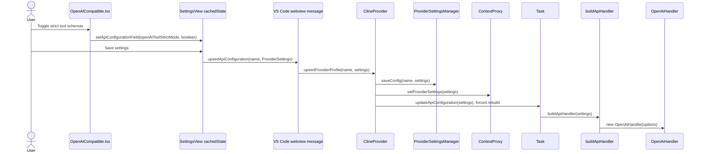
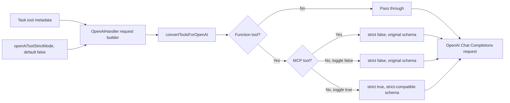
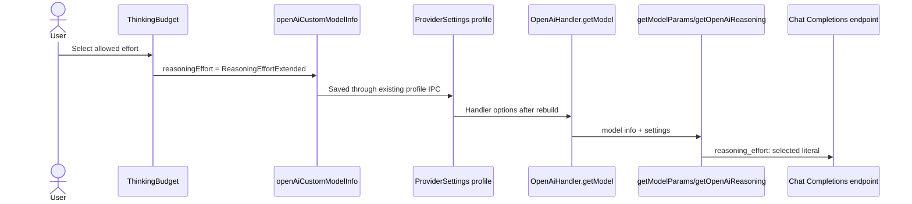

# Architect Task Report: OpenAI-Compatible Strict Tools and Reasoning Effort

## Task Summary

Investigated the OpenAI Compatible provider without implementing source changes. The investigation traced UI state, profile persistence, extension IPC, handler reconstruction, reasoning request transformation, tool-schema conversion, current tests, and official OpenAI and Upstage specifications.

## Actions Taken

- Mapped reasoning-effort types, settings UI, model capability selection, persistence, and request serialization.
- Located strict-mode behavior and distinguished OpenAI Compatible from OpenAI Native and MCP-specific policies.
- Verified current official OpenAI reasoning and function-calling guidance.
- Verified the official Solar Open 2 model card and OpenAI-compatible serving example.
- Designed three implementation options, selected the recommended boundary, and defined focused verification commands.

## Result

**Success, investigation and architecture only. No product source code was changed.**

The original requested reasoning list is not valid for Solar Open 2. OpenAI supports a model-dependent superset, but Upstage Solar Open 2 officially documents only `none` and `high`. The correct design is therefore provider/model-specific capability selection, not a universal OpenAI Compatible list containing `low`, `medium`, `high`, `xhigh`, and `max`.

For strict tools, the profile must own an OpenAI Compatible-specific boolean with an effective default of false. The handler must preserve MCP tools as non-strict. The preferred behavior is to pair the strict flag with its matching schema shape, strict schemas when enabled and original best-effort schemas when disabled.

## Issues Discovered

1. The OpenAI Compatible UI uses an unsafe cast from an extended value such as `xhigh` to the narrower `ReasoningEffort` type.
2. Setting `strict: false` currently does not produce a genuinely non-strict schema for non-MCP tools because the converter still marks every property required and adds `additionalProperties: false`.
3. The alternate AI SDK `OpenAICompatibleHandler` also calls the shared conversion method. Although it is not the handler selected by the current OpenAI Compatible settings UI and no subclass references were found, a signature change must preserve its current default behavior.
4. The special O1/O3-family Chat Completions path casts reasoning effort to only `low | medium | high`, which is stale relative to shared extended values.
5. A failed documentation search required a direct official-page fallback. The environment issue is recorded separately.

## Next Step Recommendations

- Delegate Option A as five independent implementation tasks in the order listed below.
- Do not label the five-value OpenAI superset as Solar Open 2 compatible.
- If Solar Open 2 receives a product preset later, encode its exact `none | high` capability array in model/provider metadata rather than widening the generic UI.
- Keep OpenAI Native behavior unchanged.

## Affected File List

- `packages/types/src/provider-settings.ts` (planned)
- `packages/types/src/__tests__/provider-settings.test.ts` (planned)
- `webview-ui/src/components/settings/providers/OpenAICompatible.tsx` (planned)
- `webview-ui/src/i18n/locales/en/settings.json` (planned)
- `webview-ui/src/components/settings/__tests__/ApiOptions.spec.tsx` (planned)
- `webview-ui/src/components/settings/__tests__/ThinkingBudget.spec.tsx` (planned only if generic max coverage is absent)
- `src/api/providers/base-provider.ts` (planned)
- `src/api/providers/openai.ts` (planned)
- `src/api/providers/__tests__/base-provider.spec.ts` (planned)
- `src/api/providers/__tests__/openai.spec.ts` (planned)
- `src/api/providers/openai-compatible.ts` (compatibility review, likely no source edit)

---

# [1. Technical Specification]

## Overview

### Goals

1. Add a profile-scoped toggle controlling strict function-tool schemas for the OpenAI Compatible provider.
2. Keep existing profiles and endpoints working by treating an absent toggle as false.
3. Keep MCP tools non-strict even when strict mode is enabled, because MCP schemas may contain optional properties that must remain optional.
4. Represent reasoning support as a provider/model capability rather than assuming every OpenAI-compatible server accepts OpenAI's full enum.
5. Remove the unsafe narrow reasoning cast in the OpenAI Compatible settings component.

### Core constraints

- Scope is the `apiProvider: "openai"` OpenAI Compatible profile, not the separate OpenAI Native provider.
- Existing profile JSON must deserialize without migration.
- The settings view must continue using its local buffered state. Inputs must not bind directly to live extension state.
- Strict false and strict true require different JSON Schema semantics.
- The feature must cover streaming, non-streaming, and special O1/O3 request paths.
- No new dependency is needed.

## Specification findings

### OpenAI reasoning effort

OpenAI's official reasoning guide states that supported values are model-dependent and can include:

`none`, `minimal`, `low`, `medium`, `high`, `xhigh`, `max`.

Source: https://platform.openai.com/docs/guides/reasoning.md

This is a capability superset, not a promise that every OpenAI model or compatible endpoint accepts every value.

### Solar Open 2 reasoning effort

The official Upstage Solar Open 2 model card documents exactly:

| Value | Documented behavior |
| --- | --- |
| `none` | Direct response |
| `high` | Reasoning capped at 131,072 tokens under the recommended serving setup |

It recommends `high` for complex and agentic work and `none` for direct responses. Its OpenAI-compatible Chat Completions example sends `reasoning_effort: "high"`.

Source: https://huggingface.co/upstage/Solar-Open2-250B

Therefore, the requested five-value list `low | medium | high | xhigh | max` must not be described as Upstage-compatible. For Solar Open 2, the documented list is `none | high`.

### OpenAI strict tools

OpenAI's official function-calling guide states:

- Chat Completions is non-strict by default.
- Strict mode requires `additionalProperties: false` on every object.
- Every property must be listed in `required`.
- Optional values are represented by nullable types.
- Explicit `strict: false` keeps best-effort function calling.

Source: https://platform.openai.com/docs/guides/function-calling.md

This means the existing implementation is internally inconsistent: it emits `strict: false` but still applies most strict-schema transformations.

## Frontend to backend type contract

### Proposed persisted field

Use an OpenAI-specific field:

```ts
openAiToolStrictMode?: boolean
```

Effective value:

```ts
const strictMode = options.openAiToolStrictMode ?? false
```

Why this name:

- `openAi` identifies the profile namespace already used by the provider.
- `Tool` prevents confusion with structured response output or transport validation.
- `StrictMode` matches the OpenAI function definition term.

Do not place this field in the shared base provider schema. That would expose OpenAI-specific request semantics to unrelated providers.

### Tool conversion contract

Use an options object instead of a positional boolean so future compatibility flags remain readable:

```ts
type OpenAIToolConversionOptions = {
  strict?: boolean
}

convertToolsForOpenAI(tools, { strict: options.openAiToolStrictMode ?? false })
```

Effective per-tool policy:

| Tool category | Profile toggle | Emitted strict | Schema |
| --- | ---: | ---: | --- |
| Non-function | either | unchanged | unchanged |
| Native function | false/unset | false | preserve original best-effort schema |
| Native function | true | true | strict-compatible conversion |
| MCP function | either | false | preserve original MCP schema |

This table is the core invariant to test.

### Reasoning capability contract

Keep the shared extended union as the wire-level superset:

```ts
type ReasoningEffortExtended =
  | "none"
  | "minimal"
  | "low"
  | "medium"
  | "high"
  | "xhigh"
  | "max"
```

Use `ModelInfo.supportsReasoningEffort` as the selectable subset for a concrete model or endpoint. Do not replace the subset with a single global provider list.

Recommended generic OpenAI Compatible fallback, if product requirements insist on exposing the current OpenAI superset:

```ts
["low", "medium", "high", "xhigh", "max"]
```

Solar Open 2-specific metadata or a future preset must override it with:

```ts
["none", "high"]
```

The generic fallback is user-declared endpoint capability. It must not be called Solar Open 2 support.

## Cross-domain data flows

### Strict setting save and activation



No bespoke IPC message is required. Adding the field to the provider schema includes it in generated provider-setting keys and existing profile transport.

### Strict request generation



The same conversion call must be used in normal streaming, normal non-streaming, O1/O3 streaming, and O1/O3 non-streaming paths.

### Reasoning request generation



### Error handling

No new public error type is required. Endpoint rejection continues through the existing OpenAI error wrapper. The UI copy should warn that:

- strict mode can be rejected by compatible servers;
- supported reasoning values depend on the selected model/server;
- selecting an unsupported value can produce an HTTP 400 response.

Do not silently retry a request by changing strictness or reasoning effort. Silent fallback makes requests nondeterministic and hides capability misconfiguration.

---

# [2. Architecture Decisions]

## Decision: provider/model-specific reasoning subsets

Adopt the existing `ModelInfo.supportsReasoningEffort` capability array as the authority for selectable values.

Reasons:

1. OpenAI explicitly says supported values are model-dependent.
2. Solar Open 2 documents only `none` and `high`.
3. The shared type already contains the full superset, including `max`.
4. The reusable dropdown already accepts explicit capability arrays.
5. A global enum expansion is not required.

## Decision: profile-scoped strict boolean

Store strictness in the OpenAI Compatible profile as `openAiToolStrictMode?: boolean`, with false as the effective default.

Reasons:

1. Different endpoints behind the same provider UI have different compatibility behavior.
2. Profiles may target OpenAI, Azure, Upstage, vLLM, or other compatible servers.
3. A global setting would leak one endpoint's choice into another.
4. Optional false preserves old profiles and current Upstage behavior.

## Decision: MCP override remains non-strict

MCP tools stay `strict: false` regardless of the profile toggle.

Reasons:

1. Current code deliberately preserves optional MCP parameters.
2. Converting every property to required changes third-party MCP contracts.
3. The toggle is for compatible endpoint strictness, not permission to rewrite external tool interfaces.

## Exactly three design options

### Option A, The Standard / The Right Way, recommended

Pair the strict flag with matching schema semantics and keep reasoning subsets model-specific.

- **Effort:** Medium. Shared type field, UI toggle, localization, converter policy, four handler call sites, focused tests.
- **Risk:** Medium-low. The non-strict path stops rewriting native schemas, which is correct but can expose assumptions hidden by the current converter.
- **Outcome:** The toggle means what it says. Strict true conforms to OpenAI requirements. Strict false preserves optional parameters. Solar/OpenAI differences remain explicit.

### Option B, The Practical / The Pragmatic Way

Toggle only the emitted `strict` boolean while retaining current schema hardening for native non-MCP tools. Add `max` to the generic UI list.

- **Effort:** Low.
- **Risk:** Low immediate regression risk, medium semantic risk. `strict: false` still sends a schema where optional fields have been made required.
- **Outcome:** Solves providers that reject the strict field value, but does not provide true best-effort schema behavior. The UI still depends on user knowledge for model compatibility.

### Option C, The Staging / The Incremental Way

Keep `strict: false` and current request behavior. Add diagnostic UI text or a temporary advanced setting that is not sent until endpoint-specific tests are available. Keep current reasoning options and document manual Solar configuration.

- **Effort:** Very low.
- **Risk:** Low code risk, high product incompleteness.
- **Outcome:** Useful for immediate UX validation only. It does not meet the requested configurable behavior and must not be treated as the final solution.

## Dependency analysis

- No package addition is necessary.
- Zod already validates persisted provider settings.
- Existing `ProviderSettings` and `ApiHandlerOptions` type flow should carry the field automatically.
- Existing React `Checkbox` and translation infrastructure are sufficient.
- Existing OpenAI SDK request objects may not type every compatible-provider reasoning literal. Keep the compatibility cast localized at the request boundary, not in the UI model type.
- The unused or dormant AI SDK `OpenAICompatibleHandler` invokes the same converter without configuration. An optional converter options argument must default to false to avoid changing that path accidentally.

## Risks and edge cases

| Risk or edge case | Required handling |
| --- | --- |
| Existing profile lacks new field | Effective false, no migration failure |
| Endpoint rejects `strict` even when false | Current code already emits explicit false. If a server requires omission, that is a separate tri-state design, not part of this boolean feature |
| MCP tool contains optional properties | Preserve schema and force false |
| Non-MCP nested objects/arrays under strict true | Recursively add `additionalProperties: false` and required lists while preserving optionality via nullable representation |
| Converter currently removes nullability | Correct this before claiming strict schemas preserve optional fields, or explicitly document the limitation |
| Solar user chooses `low`, `medium`, `xhigh`, or `max` | Prevent through Solar-specific capability metadata where available; generic custom endpoints remain user-configured |
| Reasoning disabled | Omit `reasoning_effort`; do not send a sentinel `disable` |
| Saved invalid effort after model subset changes | Existing `ThinkingBudget` clamping behavior should select a valid capability/default without emitting an unsupported literal |
| Streaming disabled | Strictness and reasoning must remain identical in the non-streaming path |
| O1/O3 path | Pass strict option at both tool call sites and remove stale narrow reasoning casts if touched |
| OpenAI Native | No behavior change |
| Azure-compatible endpoint | The setting is profile-scoped and defaults false; user opts in only after endpoint validation |

## Breaking-change assessment

### Backward compatible

- Optional boolean field.
- Effective false default.
- Existing profile and export formats continue parsing.
- Shared reasoning enum already contains `max`.

### Behavioral change under Option A

- Native non-MCP tools in false mode regain their original optional-property shape instead of being silently hardened. This is semantically correct but observable.
- Strict true can cause endpoint HTTP 400 responses if the endpoint lacks strict support or a schema cannot be normalized.

### Not in scope

- Automatic endpoint capability discovery.
- A Solar Open 2 first-class provider preset.
- Switching OpenAI Compatible from Chat Completions to Responses.
- Changing OpenAI Native strict policy.
- Introducing a three-state omit/false/true strict setting.

---

# [3. Implementation Plan (Sub-tasks)]

## Implementation Plan

### Sub-task 1: Define and validate the persisted profile contract

**Exact files to modify**

- `packages/types/src/provider-settings.ts`
- `packages/types/src/__tests__/provider-settings.test.ts`

**Work boundary**

- Add `openAiToolStrictMode: z.boolean().optional()` to the OpenAI-specific schema.
- Confirm the inferred `ProviderSettings` accepts true, false, and omission.
- Confirm the generated provider settings key list includes the new key and secrets handling is unaffected.

**Implementation prerequisites**

- Final approval of the field name.
- No source task should add a migration that defaults stored profiles to true.

**Verification and test protocol**

- Existing suite: package-local type tests.
- Add focused schema/key assertions in `packages/types/src/__tests__/provider-settings.test.ts`.
- Command: `pnpm --filter @roo-code/types test -- --run src/__tests__/provider-settings.test.ts`
- If the package script does not forward Vitest arguments, use the package directory's local command: `cd packages/types; npx vitest run src/__tests__/provider-settings.test.ts`

### Sub-task 2: Add the buffered UI toggle and correct reasoning typing/capabilities

**Exact files to modify**

- `webview-ui/src/components/settings/providers/OpenAICompatible.tsx`
- `webview-ui/src/i18n/locales/en/settings.json`
- Translation locale files under `webview-ui/src/i18n/locales/*/settings.json`, following the repository translation workflow
- `webview-ui/src/components/settings/__tests__/ApiOptions.spec.tsx`
- `webview-ui/src/components/settings/__tests__/ThinkingBudget.spec.tsx` only if no existing generic `max` coverage proves rendering and selection

**Work boundary**

- Bind the checkbox to the supplied buffered `apiConfiguration`, never live extension state.
- Display unchecked when the field is absent.
- Add concise warning copy about endpoint compatibility and MCP override.
- Replace the narrow `ReasoningEffort` cast with `ReasoningEffortExtended`.
- Expose the approved generic custom-endpoint subset. If the immediate product request remains five OpenAI values, use `low | medium | high | xhigh | max`, while documenting that Solar needs `none | high` metadata.

**Implementation prerequisites**

- Sub-task 1 type field available.
- Product decision on whether generic custom endpoints expose the five-value list or a user-configurable capability subset.
- Translation changes must follow the project's localization process.

**Verification and test protocol**

- Existing suite: React webview settings tests.
- Assert checkbox initial false, true/false updates, selected `max` stored in `openAiCustomModelInfo`, and explicit subset rendering.
- Command: `cd webview-ui; npx vitest run src/components/settings/__tests__/ApiOptions.spec.tsx src/components/settings/__tests__/ThinkingBudget.spec.tsx`

### Sub-task 3: Make tool conversion policy explicit and semantically correct

**Exact files to modify**

- `src/api/providers/base-provider.ts`
- `src/api/providers/__tests__/base-provider.spec.ts`

**Work boundary**

- Add an optional conversion options object with false default.
- Preserve non-function tools.
- Preserve original schemas when strict is false.
- Strict-convert native function schemas only when true.
- Preserve MCP schemas and force false in all cases.
- Review nullability conversion. OpenAI requires nullable types to represent optional fields in strict mode, so do not remove nullability while marking the field required.

**Implementation prerequisites**

- Agreement on Option A versus Option B.
- Inventory any other callers of the shared converter before changing its signature.

**Verification and test protocol**

- Existing suite: provider unit tests.
- Add a matrix for non-function, native false, native true, MCP false, and MCP true.
- Include nested object/array and nullable optional-property assertions.
- Command: `cd src; npx vitest run api/providers/__tests__/base-provider.spec.ts`

### Sub-task 4: Wire profile strictness into every OpenAI Compatible request path

**Exact files to modify**

- `src/api/providers/openai.ts`
- `src/api/providers/__tests__/openai.spec.ts`
- `src/api/providers/openai-compatible.ts` only if needed to make its default call explicit; otherwise review-only

**Work boundary**

- Pass `{ strict: this.options.openAiToolStrictMode ?? false }` to all four tool-conversion call sites.
- Keep complete-prompt behavior unchanged because it sends no tools.
- Verify normal streaming, normal non-streaming, O1/O3 streaming, and O1/O3 non-streaming.
- Do not modify OpenAI Native.
- If the O1/O3 reasoning cast is changed, use the request-boundary compatible union and add a dedicated test rather than broad `any` casts.

**Implementation prerequisites**

- Sub-tasks 1 and 3 complete.
- Existing mocked OpenAI client request capture understood.

**Verification and test protocol**

- Existing suite: OpenAI handler unit tests.
- Assert default/unset false, enabled true for native tools, MCP false under enabled profile, and equal behavior in streaming/non-streaming paths.
- Add a reasoning `max` pass-through assertion for a generic compatible model if the UI exposes it.
- Command: `cd src; npx vitest run api/providers/__tests__/openai.spec.ts`

### Sub-task 5: Verify persistence and cross-boundary behavior

**Exact files to modify**

- Prefer no production file changes.
- Add a narrow regression case to an existing profile/config test only if unit coverage does not prove round-trip persistence, likely `src/core/config/__tests__/importExport.spec.ts` or the nearest `ProviderSettingsManager` test.

**Work boundary**

- Prove a named OpenAI Compatible profile round-trips the boolean.
- Prove omission remains omission or false by effective interpretation.
- Prove activation rebuilds the handler with the selected value using the existing `upsertApiConfiguration` flow.
- Avoid e2e unless the extension-host boundary cannot be represented at the integration layer.

**Implementation prerequisites**

- Sub-tasks 1 through 4 complete.
- Follow repository guidance to use the narrowest test layer.

**Verification and test protocol**

- Existing suite: core config/profile integration tests.
- Command if `importExport.spec.ts` is used: `cd src; npx vitest run core/config/__tests__/importExport.spec.ts`
- Final focused regression sweep: `cd src; npx vitest run api/providers/__tests__/base-provider.spec.ts api/providers/__tests__/openai.spec.ts core/config/__tests__/importExport.spec.ts`
- UI sweep: `cd webview-ui; npx vitest run src/components/settings/__tests__/ApiOptions.spec.tsx src/components/settings/__tests__/ThinkingBudget.spec.tsx`

## Acceptance criteria

1. A new OpenAI Compatible profile and an old profile both default to non-strict tools.
2. Enabling strict mode sets `strict: true` only for non-MCP function tools.
3. Strict-enabled schemas meet OpenAI requirements recursively and preserve logical optionality through nullability.
4. MCP tools remain non-strict and retain optional parameters.
5. Saving the toggle rebuilds the active task handler without restarting the extension.
6. Reasoning values are typed as the extended union and serialized literally when enabled.
7. Solar Open 2 is represented as supporting only `none` and `high` wherever Solar-specific metadata exists.
8. Generic custom endpoint UI does not claim that its OpenAI superset is supported by every server.
9. Streaming and non-streaming requests have identical strict behavior.
10. OpenAI Native tests remain unchanged and passing.
